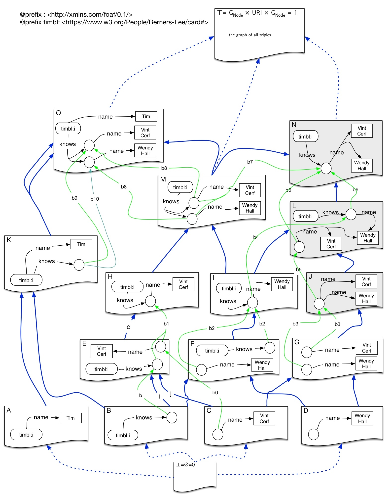

# Perspectives

This started off as a playground to help me understand the article
[Perspectives](https://semprag.org/article/view/sp.9.21) by Ash Asudeh and Gianluca Giorgolo that appeared in Semantics and Pragmatics in 2016. A shorter and perhaps more readable version appeared in 2014 as [Monads as a solution for generalized opacity](https://www.aclweb.org/anthology/W14-1403/).

They consider famous problems in the philosophy of language such as how to represent sentences such as Laura Lane does not believe that Superman is Clark Kent, where both Superman and Clark Kent refer to the same entitity (in the fictional world of the comic strips). They use the Reader Monad to solve this problem of belief contexts. I found this article by reading David Corfield's [Modal HoTT chapter 4](http://philsci-archive.pitt.edu/15260/) (also see slides [How we use monads without ever realising it](https://ncatlab.org/davidcorfield/files/monad.pdf)).

The code is in Scala which does not have linear types, but those are probably mostly useful for the linguistic side of things.

The [Point of View (PoV)](src/main/scala/PoV.scala) code shows a simplified view of their proposal, with a simple PoV Reader Monad. In the [Test Scala Worsheet](src/main/scala/Test.sc) I show how one can get the results that they get in their document.

## Application to RDF

Even though [RDF Semantics](https://www.w3.org/TR/rdf11-mt/) also has an interpretation function that maps URIs to resources, developing RDF with mutliple interpretation functions does not seem like quite the right way to go, or should at least not be the first way to look at adapting these ideas.

A multiplicity of interpretation functions would be problematic for RDF understood as a global machine readable logic. It would enhance a tempting form of subjectivism, risking one to end up with a humpty dumpty world where anyone can mean anything by any word. The authors do address this issue in the later paper and perhaps the following proposal can be made compatible with it.  Before reworking the interpretation function of RDF, it may be better to explore the following inferential thinking.
 
Here I take philosophical inspiration from [Robert Brandom](https://www.pitt.edu/~rbrandom/)s' inferential semantics, though in a way it is a natural thing to do if one things computationally about building apps to read data on the web. We can first see that RDF graphs imply other graphs and form (at it's simplest) a category RDFHom as shown in Benjamin Braatz's thesis [Formal Modelling and Applicationof Graph Transformations in theResource Description Framework](https://pdfs.semanticscholar.org/b8c8/5a3e7a04020259ec9a58c7e5563033f52844.pdf). I attempt to illustrate this category in the diagram below (which I drew up 2 years ago)
 
 
 
 In the above morphisms in blue show implication between graphs and in green mappings from blank nodes to blank nodes. Greyed out nodes are nonsensical or false.
 
 One would need more advanced categories of RDF Graphs that take into account `owl:sameAs` relations. Perhaps using [”Knowledge Representation in Bicategories of Relations](https://arxiv.org/pdf/1706.00526.pdf). If one takes an agent's beliefs as consisting of a set of such graphs, then one can see another way to construe that Rezza does not believe that { Hesperus = Phosphorus}, namely by checking if in the union of the graphs he believes to be true, that triple appears. That makes the reasoning inferentiable and computable. The semantic map to the world, can then be moved over to pragmatics, namely how to use such graphs.
 
 Still in a way a set of such graphs could imply an interpretation function as proposed in "Perspectives", namely one that sends any URI to the set of other URIs related by `owl:sameAs` in the full belief graph of a user.
 
The article's use of monads to explain perspectives is very interesting, and so it would be interesting how far this is applicable in this category too.
 
 ## Todo
 
 Is RDFHom a Topos? Are the other RDF Categories that build in OWL reasoning ones too? What would a modal logic for those be then? 
 
 If so it looks like one should be able to form a slice topos RdfHom/Person somehow and get some modal logic out of it following David Corfield's introduction in his chapter 4 of [Modal HoTT](http://philsci-archive.pitt.edu/15260/) book which I describe in [Modal HoTT on the Web](https://medium.com/@bblfish/modal-hott-on-the-web-2f4f7996b41f). To do that it would be helpful to work in a category of named pointed graphs. (Otherwise how would one pick out an object in a graph?)
 
 Also I need to re-read [”Knowledge Representation
 in Bicategories of Relations](https://arxiv.org/pdf/1706.00526.pdf)” by Evan Patterson at Stanford, where he shows how a form of typed OWL can be understood category theoretically.
 
 What is needed is a way to find a semantics for Quads as specified in [RDF1.1 Named Graphs](https://www.w3.org/TR/rdf11-concepts/#dfn-named-graph) but which appeared long before in [SPARQL](https://www.w3.org/TR/sparql11-overview/) and in [Tim Berners-Lee's N3 notation and cwm reasoner](https://www.w3.org/2000/10/swap/doc/Processing). These allow one to write things like
 
 ```N3
 LauraLane believes { Superman ≠ ClarkKent } .
```                                

which is exactly the type of thing one cannot write in an RDF 1.0 graph (unless one places the object inside an RDF/XML literal! and that is how it is implicit in RDF1.0) and which is the topic of the Perspectives papers, which use monads to explain the problem. 

The following papers also look at the problem of context in RDF:
 * 2007 Tim Berners-Lee, Dan Connolly, Lalana Kagal, Yosi Scharf, Jim Hendler [N3Logic: A Logical Framework For the World Wide Web](https://arxiv.org/abs/0711.1533)
 * 2007, Pat Hayes' [Context Mereology](https://www.semanticscholar.org/paper/Context-Mereology-Hayes/937432fa25fb963f50006ea296a8a6e3c628d132)
 * 2010, Bao, Jie, Tao, Jiao, McGuinness, Deborah L. and Smart, Paul [Context Representation for the Semantic Web](https://eprints.soton.ac.uk/270829/) 
 
 My [2nd year report](http://co-operating.systems/2019/04/01/PhD_second_year_report.pdf) tentatively explores some of these issues and the use of monads for security reasoning following in the steps of Abadi. Abadi also worked on information flow with indexed monads. This has been very recently given a very interesting description using modal HoTT in [Modalities, Cohesion, and Information Flow"](arxiv.org/abs/1809.07897) by G.A.Kavvos. 
                               
 
 
 
